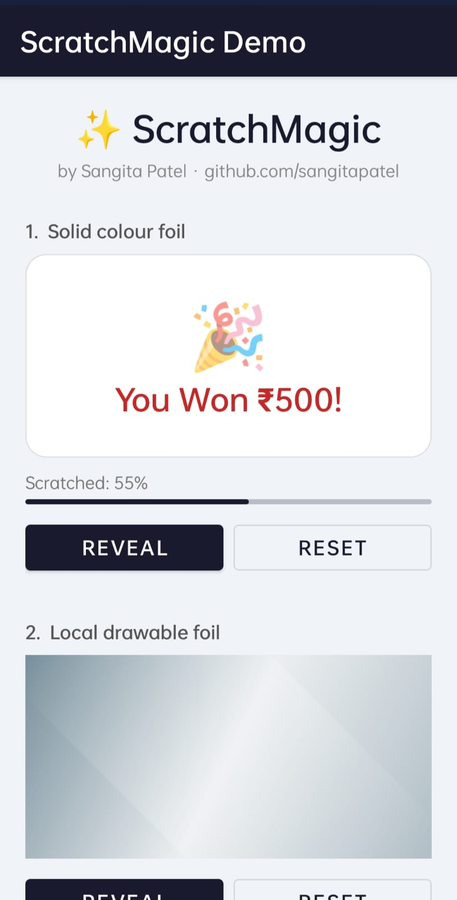
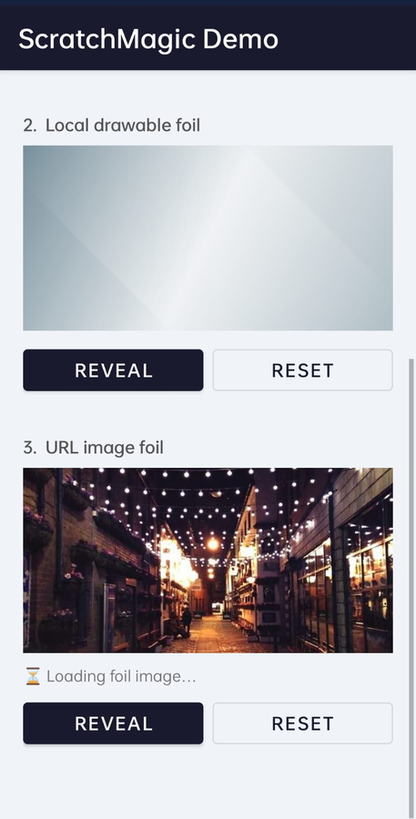

# ✨ ScratchMagic


[](https://jitpack.io/#sangitapatel/MagicScratchCard)
[](https://android-arsenal.com/api?level=21)
[](LICENSE)
[](https://github.com/sangitapatel)

**ScratchMagic** is a lightweight Android library that adds a beautiful scratchable foil
layer to any View — supporting solid colours, local drawables, and remote images.
Built entirely from scratch by [Sangita Patel](https://github.com/sangitapatel).

---

## 📸 Preview

<p align="center">
  
  &nbsp;&nbsp;&nbsp;
  
</p>

---

## ✅ Features

| Feature | Details |
|---|---|
| 🎨 Solid colour foil | Any hex / `@color` resource |
| 🖼️ Local drawable foil | `@drawable` or resource id |
| 🌐 Remote image foil | Load any URL bitmap via Glide or custom loader |
| 🖌️ Configurable brush | `smv_brushRadius` in dp |
| 📊 Reveal threshold | `smv_threshold` — 0 to 100 % |
| ✨ Auto-reveal animation | Smooth radial wipe with `EaseOutQuart` curve |
| 📡 Progress callback | `onProgress(view, percent)` |
| ✔️ Completion callback | `onDone(view)` |
| 🎮 Programmatic control | `reveal()` / `reset()` |
| 📜 ScrollView safe | Blocks parent touch interception automatically |
| 📱 API 21+ | Works on all modern Android devices |

---

## 🚀 Installation

### Step 1 — `settings.gradle.kts`

```kotlin
dependencyResolutionManagement {
    repositories {
        google()
        mavenCentral()
        maven { url = uri("https://jitpack.io") }   // ← add this
    }
}
```

### Step 2 — `build.gradle.kts` (app module)

```kotlin
dependencies {
    implementation("com.github.sangitapatel:MagicScratchCard:1.0.0")
}
```

---

## 🛠️ Quick Start

### 1. Add to XML

```xml
<FrameLayout
    android:layout_width="match_parent"
    android:layout_height="200dp">

    <!-- Your hidden prize / content here -->
    <TextView
        android:layout_width="wrap_content"
        android:layout_height="wrap_content"
        android:layout_gravity="center"
        android:text="You Won ₹500!" />

    <!-- ScratchMagicView sits on top as the foil layer -->
    <com.sangitapatel.scratchmagic.ScratchMagicView
        android:id="@+id/scratchView"
        android:layout_width="match_parent"
        android:layout_height="match_parent"
        app:smv_foilColor="#9E9E9E"
        app:smv_brushRadius="44dp"
        app:smv_threshold="60"
        app:smv_animateReveal="true"
        app:smv_animateDuration="450" />

</FrameLayout>
```

### 2. Set listener + controls (Kotlin)

```kotlin
val scratchView = findViewById<ScratchMagicView>(R.id.scratchView)

scratchView.listener = object : ScratchMagicView.ScratchListener {
    override fun onProgress(view: ScratchMagicView, percent: Float) {
        progressBar.progress = percent.toInt()
        tvPercent.text = "${percent.toInt()}% scratched"
    }
    override fun onDone(view: ScratchMagicView) {
        Toast.makeText(this@MainActivity, "Revealed!", Toast.LENGTH_SHORT).show()
    }
}

btnReveal.setOnClickListener { scratchView.reveal() }
btnReset.setOnClickListener  { scratchView.reset()  }
```

---

## 🎨 Foil Modes

### 1. Solid colour
Set any color directly in XML or programmatically:

```xml
app:smv_foilColor="#9E9E9E"
```
```kotlin
scratchView.foilColor = Color.parseColor("#9E9E9E")
```

---

### 2. Local drawable
Use any drawable resource as the foil texture:

```xml
app:smv_foilDrawable="@drawable/my_foil_texture"
```
```kotlin
scratchView.setFoilDrawable(R.drawable.my_foil_texture)
```

---

### 3. Remote image (URL)
Load any remote image as the foil using Glide or a custom loader:

```kotlin
// Using Glide + CustomTarget
Glide.with(this)
    .asBitmap()
    .load("https://example.com/foil.png")
    .into(object : CustomTarget<Bitmap>() {
        override fun onResourceReady(resource: Bitmap, transition: Transition<in Bitmap>?) {
            scratchView.setFoilBitmap(resource)
        }
        override fun onLoadCleared(placeholder: Drawable?) {}
    })
```

---

## 📐 XML Attributes

| Attribute | Type | Default | Description |
|---|---|---|---|
| `smv_foilColor` | color | `#BDBDBD` | Solid colour foil |
| `smv_foilDrawable` | reference | — | Drawable as foil texture |
| `smv_brushRadius` | dimension | `44dp` | Finger brush radius |
| `smv_threshold` | float | `60` | Reveal % to trigger `onDone` |
| `smv_animateReveal` | boolean | `true` | Auto-animate reveal at threshold |
| `smv_animateDuration` | integer (ms) | `450` | Animation duration |

---

## 📖 Full Public API

```kotlin
// ── Configuration ──────────────────────────────────────────
scratchView.brushRadius      = 44f          // pixels
scratchView.threshold        = 60f          // 0–100
scratchView.foilColor        = Color.GRAY
scratchView.foilDrawable     = myDrawable
scratchView.animateReveal    = true
scratchView.animateDuration  = 450L
scratchView.sampleStep       = 4            // pixel sampling grid (1=exact, 8=fast)
scratchView.listener         = myListener

// ── Setters ────────────────────────────────────────────────
scratchView.setFoilBitmap(bitmap)           // raw bitmap (e.g. from Glide)
scratchView.setFoilDrawable(R.drawable.x)   // resource id

// ── Control ────────────────────────────────────────────────
scratchView.reveal(animate = true)          // reveal card
scratchView.reset()                         // cover again

// ── Read-only ──────────────────────────────────────────────
val pct  : Float   = scratchView.revealPercent    // 0–100
val done : Boolean = scratchView.isFullyRevealed
```

---

## 📄 License

```
MIT License — Copyright (c) 2026 Sangita Patel
https://github.com/sangitapatel
```

See [LICENSE](LICENSE) for full text.
